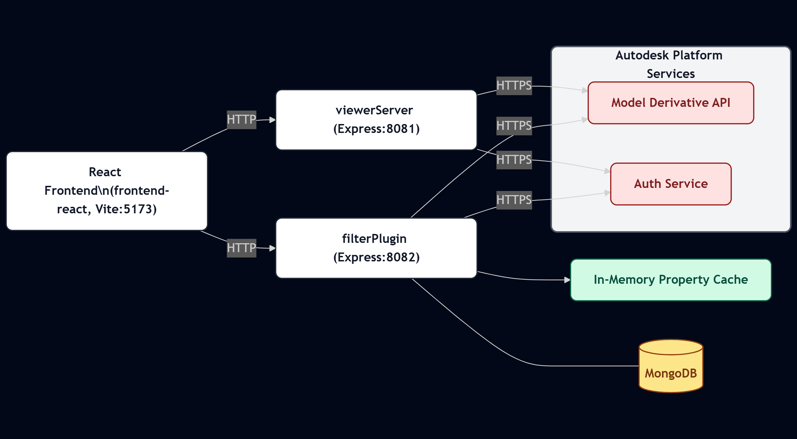
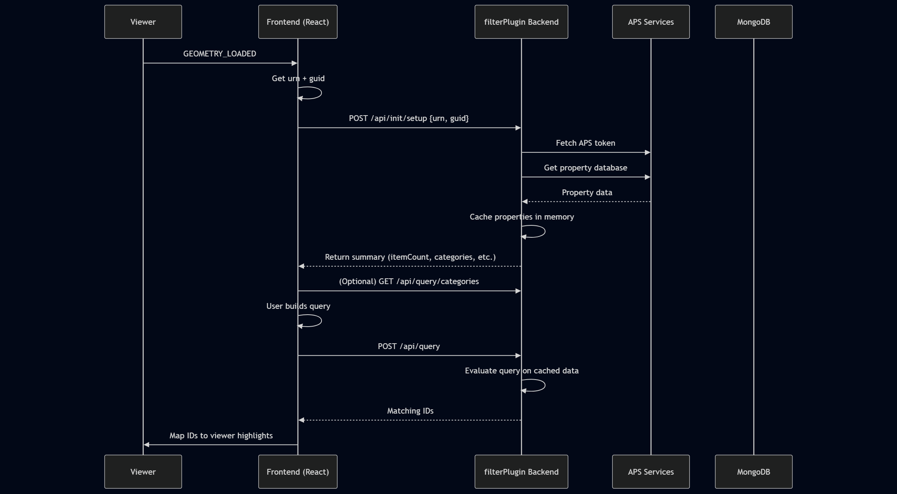

# Filter Plugin Integration Documentation

## Overview
This document explains the integration between the React frontend (`frontend-react`) and the Filter Plugin backend (`filterPlugin`, port 8082) which queries Autodesk Platform Services (APS) model derivative data. It covers architecture, data flow, available API endpoints, query execution lifecycle, local development workflow, and operational notes. Secret values are intentionally omitted.

## High-Level Architecture



- The frontend loads a model through the separate `viewerServer` (port 8081) which supplies APS tokens and translation/status endpoints.
- Once the viewer finishes geometry load, the frontend captures the active viewable GUID and calls `POST /api/init/setup` on the Filter Plugin providing the model URN + GUID.
- The Filter Plugin fetches model property data from APS (or falls back to static test data) and builds a category->fields map kept in memory for fast querying.
- Ad-hoc and saved queries operate only on the cached in-memory structure (no round-trip to APS per query).

---

## Data Flow (Setup + Query)



1. User selects / loads a translated model in the viewer.
2. Viewer fires GEOMETRY_LOADED; frontend obtains current viewable `guid` from the viewer instance and has the `urn` (kept globally as `window.currentModelUrn`).
3. Frontend calls `POST http://localhost:8082/api/init/setup { urn, guid }`.
4. Backend:
   - Exchanges internal credentials for an APS access token (via `authService.getInternalToken()`).
   - Resolves the appropriate property database GUID (walks manifest + metadata endpoints; selects a 3d guid to fetch properties).
   - Calls APS Model Derivative properties endpoint and stores the `collection` array in memory (`modelData`).
   - Builds `categoriesMap` (category -> Set(fields)).
   - Returns summary (itemCount, categories, fallback flag).
5. Frontend (optional) fetches `/api/query/categories` to populate the query builder dropdowns.
6. User constructs query conditions and triggers execution (Query.performQuery()).
7. Frontend sends POST `/api/query` with one of:
   - Single condition shortcut `{ "conditions": { ...condition... } }`
   - Logical group `{ "logic": "AND" | "OR", "conditions": [condition|group,...] }`
   - More details in Query.md
8. Backend evaluates conditions against cached `modelData` producing matching `externalId` values (returned as `dbIds` field for now). No additional APS calls.
9. Frontend maps returned externalIds to viewer dbIds (via viewer APIs) for isolation / highlighting.

---

## API Surface Summary
See `docs/openapi.yaml` (OpenAPI 3.0) for machine-readable detail. Key endpoints:
- `GET /api/status` – health check.
- `POST /api/init/setup` – load and cache model property data; must be called once per (URN, GUID) before querying.
- `GET /api/query/categories` – returns `{ category: [fields...] }` map built during setup.
- `POST /api/query` – execute an ad-hoc query (single or nested logical).
- Saved Query CRUD:
  - `GET /api/query/saved`
  - `POST /api/query/saved` (body: id, name, query, createdBy?)
  - `GET /api/query/saved/:id`
  - `PUT /api/query/saved/:id`
  - `DELETE /api/query/saved/:id`

## Evaluation Logic (Server)
- Entire property cache is scanned per condition (linear). Nested groups recurse.
- AND: start with full id set, intersect progressively.
- OR: union of each child result set.
- Single condition: direct scan evaluating `category.field` per item.

Potential enhancement ideas:
- Pre-index frequently used category/field pairs.
- Add server-side paging or a limit on returned ids.

## Fallback / Test Data Mode
If `process.env.USE_TEST_DATA === 'true'` or APS property retrieval yields a 404, service loads `FakeModelData` (15 fabricated objects) and synthesizes categories. Response includes `usingFallback: true` in that case.

## Local Development Instructions
### Prerequisites
- Node.js (LTS) installed.
- MongoDB running locally (default URI expected by `databaseService`) for saved queries (if not running, saved-query routes will fail but core querying still works in-memory).
- APS credentials configured (client id/secret) for the viewer server & filter plugin auth (environment variables; not committed here).

### First-Time Install
From repo root:
```
npm run install:all
```
This installs dependencies in root, `viewerServer`, `filterPlugin`, and `frontend-react`.

### Run All Services (Dev)
```
npm run dev
```
Starts (via `concurrently`):
- viewerServer on 8081
- filterPlugin on 8082
- Vite dev server for React on (default) 5173

Visit the frontend (http://localhost:5173) and load a model. After geometry loads, setup call is auto-triggered.

### Manual Checks
- Health: `curl http://localhost:8082/api/status`
- Categories after setup: `curl http://localhost:8082/api/query/categories`
- Simple query:
```
POST /api/query
{ "conditions": { "category": "Dimensions", "field": "Area", "operator": "greater_than", "value": "10" } }
```

## Environment Variables (Omitted Values)
Add these to a local `filterplugin/.env` (not committed):
- APS_CLIENT_ID, APS_CLIENT_SECRET (for token retrieval in authService)
- USE_TEST_DATA=true (optional for offline/demo)
- MONGODB_URI (if different from default)

Add these to a local `viewerServer/.env` (not committed):
- APS_CLIENT_ID, APS_CLIENT_SECRET (for token retrieval in authService)
- PORT
- APS_BUCKET


## Error Handling & Edge Cases
- Missing urn/guid => 400 on setup.
- APS 401/403/404 mapped to descriptive messages; 404 triggers fallback test data.
- Query before setup => `modelData` empty; execution returns error object (frontend should surface gracefully).
- Invalid condition shape logged + returns empty match set.

## Frontend Integration Notes
- `Viewer.jsx` triggers setup after geometry load with the active viewable GUID to ensure category set matches displayed model.
- `NewQueryModal` pulls categories once per modal open to populate dropdowns.
- `Query.performQuery()` transforms user-built nested structure into backend format minimizing payload complexity for simple single-condition queries.
- Returned `dbIds` currently contain `externalId` values; conversion to internal viewer dbIds happens client-side (naming mismatch historical; could rename field to `externalIds`).

## Diagrams
Source diagrams can be added (e.g., `diagrams/architecture.drawio` + exported `architecture.png`). Current ASCII diagram above; consider future sequence diagram for Setup + Query.

## Known Gaps / Future Improvements
- Add pagination / limit + optional properties projection.
- Provide endpoint to list distinct values for a given category.field to assist UI.
- Add auth (currently open CORS in dev) for saved query management.
- Persist model property cache with TTL or per-(urn,guid) multi-cache.

## Quick Reference
| Action | Endpoint |
|--------|----------|
| Health | GET /api/status |
| Setup  | POST /api/init/setup |
| Categories | GET /api/query/categories |
| Execute Query | POST /api/query |
| List Saved Queries | GET /api/query/saved |
| Save Query | POST /api/query/saved |
| Update Query | PUT /api/query/saved/:id |
| Delete Query | DELETE /api/query/saved/:id |

